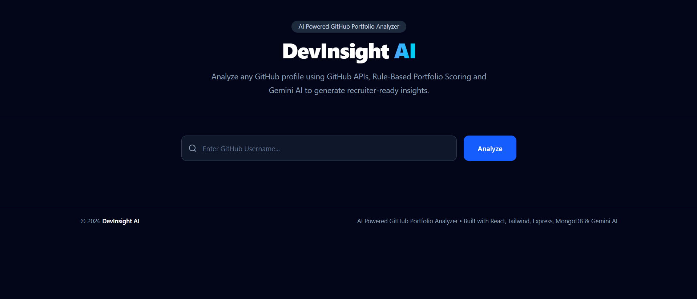
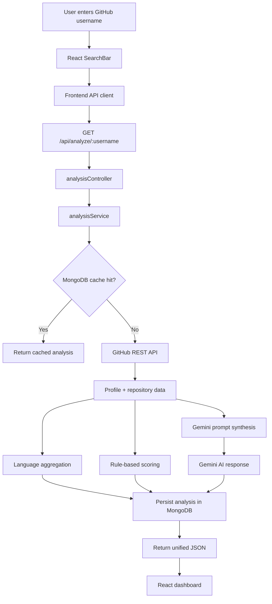
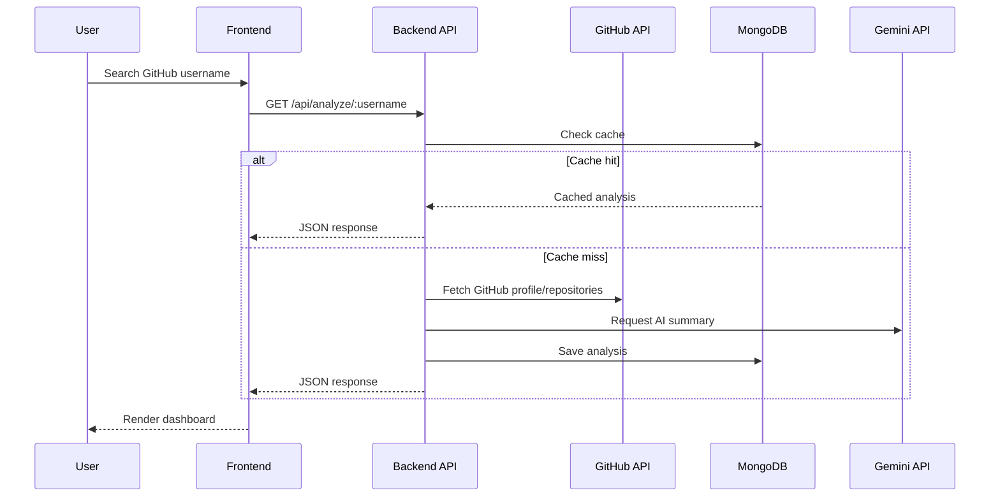

# DevInsight AI

> **Professional Logo Placeholder**  
> AI Powered GitHub Portfolio Analyzer for recruiter-ready portfolio intelligence.

[](https://react.dev/)
[](https://nodejs.org/)
[](https://www.mongodb.com/)
[](https://tailwindcss.com/)
[](LICENSE)

> **Project Banner Placeholder**  
> Replace this section with a wide banner image showing the DevInsight AI dashboard, score card, and analysis panels.

DevInsight AI turns a public GitHub username into a recruiter-friendly portfolio intelligence report. It combines GitHub REST API data, a rule-based scoring engine, MongoDB caching, and Gemini AI analysis to produce a clean SaaS-style dashboard with actionable hiring insight.

The goal is not to show raw GitHub noise. The goal is to convert public developer activity into a structured, readable, and defensible evaluation that helps recruiters, founders, and students understand engineering signal quickly.

---

## Table of Contents

- [Overview](#overview)
- [Problem Statement](#problem-statement)
- [Solution](#solution)
- [Features](#features)
- [Screenshots](#screenshots)
- [Demo](#demo)
- [Tech Stack](#tech-stack)
- [System Architecture](#system-architecture)
- [Project Structure](#project-structure)
- [Installation](#installation)
- [Environment Variables](#environment-variables)
- [API Documentation](#api-documentation)
- [Database Design](#database-design)
- [Core Algorithms](#core-algorithms)
- [Security](#security)
- [Performance Optimizations](#performance-optimizations)
- [Error Handling](#error-handling)
- [Design Decisions](#design-decisions)
- [Challenges Faced](#challenges-faced)
- [Future Scope](#future-scope)
- [Potential Use Cases](#potential-use-cases)
- [Testing](#testing)
- [Deployment Guide](#deployment-guide)
- [Contributing](#contributing)
- [License](#license)
- [Author](#author)
- [Acknowledgements](#acknowledgements)

---

## Overview

GitHub profiles often contain a lot of useful information, but almost none of it is packaged in a way that helps a recruiter make a fast decision. A reviewer must open repositories one by one, infer project quality from scattered signals, and mentally estimate engineering maturity. That is slow, inconsistent, and difficult to scale.

DevInsight AI was created to solve that problem.

This project analyzes a GitHub username and produces a polished dashboard that highlights:

- the profile identity and public activity footprint,
- language distribution across repositories,
- a normalized portfolio score,
- an overall rating,
- strengths,
- weaknesses,
- recommended skills,
- career fit indicators,
- hiring recommendation with reasoning.

The product is aimed at:

- **recruiters** who need a fast screening layer,
- **students** who want to understand how their profile is perceived,
- **developers** who want a clear benchmark for portfolio quality,
- **founders and startup CTOs** who need a quick technical signal before deeper review.

The architecture intentionally keeps the analysis pipeline modular. GitHub data is fetched, normalized, cached, scored, and then summarized by Gemini AI. This makes the system explainable, maintainable, and easy to evolve into a production SaaS.

---

## Problem Statement

Modern GitHub profiles are rich but fragmented.

A reviewer typically needs to inspect:

- profile metadata,
- repository count,
- repository quality,
- README quality,
- deployment evidence,
- language mix,
- consistency of activity,
- project complexity,
- and the general story behind the portfolio.

Existing solutions usually fall into one of two categories:

1. **Raw analytics dashboards**  
   These expose numbers but do not explain what those numbers mean in hiring terms.

2. **Generic AI summaries**  
   These can sound polished, but often lack a structured scoring model and may not reflect consistent engineering criteria.

That creates three major issues:

- **Too much manual work** for recruiters.
- **Too little structure** for candidates.
- **Too little repeatability** for teams that need a comparable evaluation across many profiles.

DevInsight AI exists because portfolio evaluation should be:

- fast,
- explainable,
- repeatable,
- and presentable.

---

## Solution

DevInsight AI solves the problem by combining three layers of intelligence:

1. **GitHub REST API** for factual profile and repository data.
2. **Rule-based scoring** for a consistent, deterministic portfolio score.
3. **Gemini AI** for human-readable insight, context, and hiring guidance.

This hybrid approach is important.

- The **rule-based layer** keeps the evaluation grounded in measurable signals.
- The **AI layer** converts those signals into recruiter-friendly language.
- The **MongoDB cache** avoids recomputation and keeps repeated lookups fast.

### Why this approach works

- It is more credible than a pure AI summary.
- It is more informative than a raw metrics dashboard.
- It is more efficient than recalculating everything on every request.
- It scales better than hardcoding every insight in the frontend.

In practical terms, a recruiter enters a GitHub username and gets a complete analysis report in one view.

---

## Features

| Feature Name | Purpose | Benefit | Implementation | Future Improvements |
|---|---|---|---|---|
| GitHub Username Analysis | Fetch and analyze any public GitHub profile | Converts a username into a structured hiring view | React search bar calls `GET /api/analyze/:username` | Add profile comparison and batch review |
| Cache-First Retrieval | Avoid repeated API and AI calls for the same profile | Faster response time and lower cost | MongoDB stores analysis by `githubUsername` | Add TTL policies and stale-while-revalidate refresh |
| Portfolio Score | Produce a single hiring signal from multiple heuristics | Makes the profile easier to evaluate at a glance | Backend scoring service generates `portfolioScore` and `overallRating` | Add transparent sub-scores and trend history |
| Language Distribution | Summarize repository language mix | Shows technical focus and breadth | Backend aggregates languages into counts | Add skill clustering and trend evolution |
| Gemini AI Analysis | Generate strengths, weaknesses, career fit, and hiring recommendation | Gives human-readable interpretation | Backend sends structured prompt to Gemini | Add multi-model comparison and feedback tuning |
| SaaS Dashboard UI | Present the result in a polished interface | Improves readability and professionalism | React + Tailwind card-based layout | Add theme switcher and saved searches |
| Responsive Layout | Support desktop and mobile use cases | Makes the experience usable in interviews and demos | Tailwind responsive utilities | Add adaptive analytics components |
| Loading and Error States | Keep the UI stable during network latency or failures | Better UX and easier debugging | Dedicated loading and error components | Add retry button and fallback suggestions |

---

## Screenshots

> Add real screenshots from the repository or deployment here.

### Dashboard



### Analytics


### Analytics


### Authentication
> Authentication is not part of the current v1 flow. This section is reserved for the SaaS roadmap.

---

## Demo

### Live Demo
> Add the deployed production URL here.

### Video Demo
> Add a short walkthrough video link here.

### GIF Placeholder
> Add a looping GIF of the analysis flow, score generation, and dashboard render.

---

## Tech Stack

| Category | Technology | Why it is used |
|---|---|---|
| Frontend | React | Component-based UI architecture with a large ecosystem |
| Frontend | Vite | Fast development server and efficient bundling |
| Frontend | Tailwind CSS | Rapid creation of a professional SaaS-style design system |
| Frontend | Lucide React | Clean, consistent iconography |
| Backend | Node.js | Lightweight JavaScript runtime for API orchestration |
| Backend | Express.js | Minimal and extensible HTTP API layer |
| Backend | Mongoose | Schema-driven MongoDB modeling |
| Database | MongoDB Atlas | Flexible document storage for cached analysis payloads |
| External API | GitHub REST API | Source of truth for public profile and repository data |
| AI | Google Gemini API | Generates portfolio interpretation and hiring language |
| HTTP Client | Axios | Simple and reliable frontend-to-backend communication |
| Security | CORS, environment variables | Keeps secrets server-side and allows controlled browser access |
| Tools | Git, GitHub | Version control and collaboration |
| Dev Setup | dotenv | Environment separation for local development |
| Future Testing | Vitest / React Testing Library | Component and logic coverage for future scale |
| Future DevOps | Docker, CI/CD, monitoring | Production hardening and deployment automation |

---

## System Architecture

### Frontend Architecture

The frontend is intentionally presentation-focused.

- `HomePage.jsx` orchestrates the request lifecycle.
- `SearchBar.jsx` collects the username.
- `ProfileCard.jsx` renders profile identity data.
- `PortfolioScoreCard.jsx` renders the score and overall rating.
- `LanguageChart.jsx` visualizes language usage.
- `AIAnalysisCard.jsx` renders Gemini output.
- `Loading.jsx` and `ErrorMessage.jsx` handle transient UI states.

The frontend does **not** calculate the score. It only renders backend-owned results.

### Backend Architecture

The backend is organized around a service layer:

- **controllers** validate and coordinate requests,
- **services** perform GitHub fetching, scoring, and Gemini summarization,
- **models** persist cache documents,
- **utils** keep repeated transformations isolated,
- **routes** expose public endpoints.

This separation keeps the system maintainable and testable.

### Database Architecture

MongoDB stores analysis payloads in a cache-oriented document model.

- each GitHub username maps to one analysis record,
- repeated lookups are served from the cache,
- timestamps track when the analysis was created and refreshed.

### Authentication Flow

The current v1 product is read-only and does not require user login.

That is a deliberate design choice:

- it reduces friction,
- keeps the demo simple,
- and allows any recruiter to try the tool instantly.

For a SaaS version, JWT or OAuth can be layered on top without changing the core analysis pipeline.

### API Flow



### Deployment Flow



### Caching Strategy

The cache is the most important performance decision in the project.

- Lookups are keyed by GitHub username.
- Cached records are returned when available.
- New analysis is generated only when needed.

This reduces:

- GitHub API pressure,
- Gemini API usage,
- and response latency.

### Error Handling

The backend is designed to return consistent error responses instead of breaking the UI with raw stack traces.

The frontend reacts to that with:

- a visible loading state,
- a friendly error message,
- and a clean recovery path through another search.

### Logging

The system is structured so logging can be added at the controller and service layers with very little refactoring.

For production-scale deployment, request IDs, structured logs, and external log aggregation should be added.

### Security

- API keys remain on the server.
- The frontend communicates only with the backend API.
- CORS is explicitly configured.
- The backend can reject invalid or malformed usernames before touching external services.

---

## Project Structure

```text
DevInsight AI/
├── backend/
│   └── src/
│       ├── config/
│       │   └── db.js
│       ├── controllers/
│       │   ├── analysisController.js
│       │   └── githubController.js
│       ├── models/
│       │   └── Analysis.js
│       ├── prompts/
│       │   └── portfolioPrompt.js
│       ├── routes/
│       │   ├── analysisRoutes.js
│       │   └── githubRoutes.js
│       ├── services/
│       │   ├── analysisService.js
│       │   ├── githubService.js
│       │   ├── geminiService.js
│       │   └── portfolioScoringService.js
│       ├── utils/
│       │   ├── apiError.js
│       │   ├── calculateLanguages.js
│       │   ├── calculateStats.js
│       │   ├── githubHelpers.js
│       │   └── scoreHelpers.js
│       ├── app.js
│       └── server.js
│
└── frontend/
    └── src/
        ├── components/
        │   ├── dashboard/
        │   │   ├── BreakdownItem.jsx
        │   │   └── PortfolioScoreCard.jsx
        │   ├── layout/
        │   │   ├── Footer.jsx
        │   │   └── Header.jsx
        │   ├── ui/
        │   │   ├── LoadingSkeleton.jsx
        │   │   └── SectionHeading.jsx
        │   ├── AIAnalysisCard.jsx
        │   ├── ErrorMessage.jsx
        │   ├── LanguageChart.jsx
        │   ├── Loading.jsx
        │   ├── ProfileCard.jsx
        │   ├── SearchBar.jsx
        │   └── StatsCard.jsx
        ├── hooks/
        │   └── useAnalysis.js
        ├── pages/
        │   └── HomePage.jsx
        ├── services/
        │   └── api.js
        ├── utils/
        │   └── formatters.js
        ├── App.jsx
        ├── index.css
        └── main.jsx
```

### Folder Purpose

- `controllers/` — request coordination and response shaping.
- `services/` — external API integration, scoring, and analysis logic.
- `models/` — MongoDB schemas for cached analysis records.
- `routes/` — HTTP route definitions.
- `utils/` — helpers for transformations, scoring, and GitHub processing.
- `components/` — reusable frontend UI pieces.
- `pages/` — page-level orchestration.
- `services/` — frontend API client.
- `hooks/` — future shared logic for analysis state or side effects.
- `ui/`, `layout/`, `dashboard/` — front-end organization by responsibility.

---

## Installation

### Prerequisites

Before starting, make sure you have:

- Node.js 18+
- npm or pnpm
- MongoDB Atlas or a local MongoDB instance
- A GitHub API token
- A Gemini API key

### Clone the repository

```bash
git clone https://github.com/<your-username>/devinsight-ai.git
cd devinsight-ai
```

### Install dependencies

#### Backend

```bash
cd backend
npm install
```

#### Frontend

```bash
cd ../frontend
npm install
```

### Environment variables

Create the required `.env` files before running the app. See the table below.

### Run development mode

#### Backend

```bash
cd backend
npm run dev
```

#### Frontend

```bash
cd frontend
npm run dev
```

### Production build

#### Frontend build

```bash
cd frontend
npm run build
```

#### Backend production start

```bash
cd backend
npm start
```

---

## Environment Variables

### Backend `.env`

| Variable | Purpose | Example | Required |
|---|---|---|---|
| `PORT` | Port for the Express server | `5000` | Yes |
| `MONGO_URI` | MongoDB connection string | `mongodb+srv://...` | Yes |
| `GITHUB_TOKEN` | Authenticated GitHub API access and higher rate limits | `ghp_xxx` | Recommended |
| `GEMINI_API_KEY` | Gemini API access | `AIza...` | Yes |
| `NODE_ENV` | Runtime mode | `development` / `production` | Optional |

### Frontend `.env`

| Variable | Purpose | Example | Required |
|---|---|---|---|
| `VITE_API_BASE_URL` | Base URL for the backend API | `http://localhost:5000/api` | Yes |

### Notes

- Keep all secrets in the backend environment only.
- Never hardcode keys into the frontend.
- Use separate values for local, staging, and production environments.

---

## API Documentation

The current public API surface is intentionally small and focused.

### Health Check

| Field | Value |
|---|---|
| Method | `GET` |
| Route | `/` |
| Purpose | Verify backend availability |
| Authentication Required | No |

#### Response

```json
{
  "success": true,
  "message": "DevInsight AI Backend is Running 🚀"
}
```

#### Status Codes

- `200 OK`

---

### Analyze GitHub Profile

| Field | Value |
|---|---|
| Method | `GET` |
| Route | `/api/analyze/:username` |
| Purpose | Fetch, analyze, cache, and return a GitHub portfolio report |
| Authentication Required | No |

#### Request Example

```bash
GET /api/analyze/encrypt2004
```

#### Response Shape

```json
{
  "success": true,
  "source": "cache",
  "data": {
    "profile": {
      "avatarUrl": "https://avatars.githubusercontent.com/u/180997449?v=4",
      "name": "Sudhanshu Kumar",
      "username": "encrypt2004",
      "bio": "Building scalable web applications...",
      "followers": 0,
      "following": 1,
      "publicRepos": 54
    },
    "aiAnalysis": {
      "portfolioScore": 51,
      "overallRating": "Learning Portfolio",
      "strengths": [],
      "weaknesses": [],
      "recommendedSkills": [],
      "careerFit": {
        "frontend": "...",
        "backend": "...",
        "fullStack": "..."
      },
      "hiringRecommendation": {
        "status": "Potential Hire",
        "reason": "..."
      }
    },
    "languageDistribution": [
      {
        "language": "JavaScript",
        "count": 22
      }
    ],
    "_id": "...",
    "githubUsername": "encrypt2004",
    "createdAt": "...",
    "updatedAt": "..."
  }
}
```

#### Status Codes

- `200 OK` — successful analysis
- `404 Not Found` — profile not found or invalid username
- `429 Too Many Requests` — rate limit or upstream restriction
- `500 Internal Server Error` — unexpected backend failure

### API Notes

- The response is designed for direct frontend rendering.
- The `source` field helps distinguish a live GitHub analysis from a cached one.
- The backend keeps the payload consistent so the frontend does not need to calculate metrics.

---

## Database Design

The current database model is a cache-oriented `Analysis` collection.

### `Analysis` Collection

| Field | Purpose |
|---|---|
| `_id` | MongoDB document identifier |
| `githubUsername` | Normalized unique key for cache lookup |
| `profile` | Profile snapshot returned from GitHub |
| `aiAnalysis` | Gemini-generated narrative and score output |
| `languageDistribution` | Aggregated repository language counts |
| `source` | Indicates whether the record came from `cache` or live GitHub fetch |
| `createdAt` | Analysis creation time |
| `updatedAt` | Last refresh time |
| `__v` | Mongoose version key |

### Why this schema works

- One document per GitHub username keeps retrieval simple.
- Cache lookup is fast and predictable.
- The model is flexible enough to store richer analysis later.
- A document store is a good fit because each analysis is naturally nested JSON.

### Index Strategy

A unique index on `githubUsername` is recommended so the cache can be queried efficiently.

### Relationships

The current system is intentionally denormalized:

- one username,
- one cached report,
- one rendered dashboard.

That reduces join complexity and keeps lookup time low.

---

## Core Algorithms

### 1) Cache-First Analysis Retrieval

**Goal:** avoid recomputing the same analysis.

**How it works:**
- normalize the username,
- check MongoDB,
- return cached data if present,
- otherwise fetch from GitHub and Gemini,
- then persist the result.

**Complexity:**
- Cache lookup: **O(1)** with indexing
- Miss path: **O(r)** where `r` is repository count

**Trade-off:**
- Slight storage cost in exchange for much faster repeated access.

---

### 2) Language Distribution Aggregation

**Goal:** summarize the language footprint across public repositories.

**How it works:**
- inspect repository language metadata,
- count the number of repositories per language,
- return a normalized list for rendering.

**Complexity:**
- Time: **O(r)**
- Space: **O(l)** where `l` is the number of unique languages

**Why this approach:**
- easy to explain,
- fast enough for public GitHub portfolios,
- and directly useful in the UI.

---

### 3) Rule-Based Portfolio Scoring

**Goal:** produce a stable score that reflects portfolio quality.

**Signals typically considered:**
- repository quality,
- README strength,
- deployment evidence,
- technology diversity,
- consistency,
- project experience.

**Why rule-based scoring matters:**
- predictable,
- explainable,
- easier to debug,
- resistant to AI hallucination.

**Complexity:**
- Time: **O(r)**
- Space: **O(1)** to **O(r)** depending on aggregation strategy

---

### 4) Gemini Prompt Synthesis

**Goal:** convert structured data into recruiter-friendly narrative.

**How it works:**
- feed the model profile and scoring context,
- ask for strengths, weaknesses, career fit, and hiring recommendation,
- store the response as structured JSON.

**Trade-off:**
- AI gives better language and context,
- but the deterministic scoring layer keeps the result grounded.

---

## Security

### Authentication
The current version is public and read-only. No login is required to analyze a profile.

### Authorization
There are no privileged write operations exposed to the client.

### JWT
JWT is not part of the current v1 experience. It is a natural next step for a SaaS version with saved history, team workspaces, or private notes.

### Encryption
- Secrets remain in environment variables.
- Database credentials and API keys stay server-side.
- The frontend never sees sensitive tokens.

### Validation
- usernames should be trimmed and normalized,
- invalid input should be rejected early,
- empty searches should not hit the backend.

### Rate Limiting
Recommended for production to protect:
- GitHub API quota,
- Gemini API spend,
- and public abuse of the endpoint.

### Input Sanitization
Only accept the GitHub username as a simple string. Reject unexpected paths or malformed values.

### Security Best Practices
- use HTTPS in production,
- keep CORS origins explicit,
- store secrets in deployment environments,
- avoid logging raw secrets,
- and sanitize all upstream responses before persistence.

### Future Security Improvements
- JWT or OAuth login,
- CSRF protection if cookies are introduced,
- role-based access control,
- audit trails,
- request throttling,
- and abuse detection.

---

## Performance Optimizations

### Caching
The biggest optimization in the project is MongoDB caching of prior analyses.

### Lazy Loading
Future dashboard sections can be lazy-loaded if charts or analytics become heavier.

### Pagination
Not needed in the current v1 because the dashboard focuses on a single profile. If repository lists or history views are added, pagination should be introduced.

### Memoization
Useful on the frontend for derived display values and on the backend for expensive scoring helpers.

### Database Indexing
A unique index on `githubUsername` keeps cache access fast.

### Compression
Recommended in production to reduce payload size.

### Scalability
This architecture can scale because:

- analysis is stateless at the request layer,
- cached records are reusable,
- services are separated cleanly,
- and the frontend only renders JSON.

---

## Error Handling

The project uses a layered error strategy.

### Backend

- validate input early,
- handle upstream API failures explicitly,
- return consistent JSON error messages,
- and keep controller/service errors separated.

### Frontend

- show a loading state while requests are in flight,
- show a readable error message if analysis fails,
- and allow the user to immediately try another username.

### Recovery Strategy

If a live GitHub or Gemini request fails, the backend should not corrupt the cache. It should return a failure response and let the user retry cleanly.

### Future Improvements

- global error middleware,
- request correlation IDs,
- structured error logging,
- retry-once logic for transient upstream failures,
- and fallback suggestions when the username is invalid or private.

---

## Design Decisions

### Why this architecture?

Because the project needs to be:

- fast enough for live demos,
- clear enough for recruiters,
- and maintainable enough for future SaaS expansion.

The stack is intentionally simple:

- React for UI,
- Express for API orchestration,
- MongoDB for flexible caching,
- Gemini for insight generation.

### Why not a heavier framework?

A heavier stack would add complexity without improving the core value of the product. The current architecture keeps development velocity high and avoids unnecessary abstraction.

### Why combine rule-based scoring with AI?

Because AI alone can be vague, while rules alone can be rigid. Together they create a more trustworthy and readable evaluation.

### Alternatives considered

- **Pure analytics dashboard:** accurate but not recruiter-friendly.
- **Pure AI summary:** readable but less consistent.
- **Feature-heavy platform:** powerful but slower to build and harder to explain.

The current design is a practical middle ground.

---

## Challenges Faced

### 1) Working with incomplete GitHub profiles
Many public profiles have no README depth, no deployment, or minimal repo metadata. The scoring and analysis logic had to remain useful even in low-signal cases.

### 2) Keeping the analysis explainable
A scoring system that cannot be explained is difficult to trust. The backend therefore separates deterministic scoring from AI narration.

### 3) Managing response-shape drift
Frontend and backend contracts need to stay in sync. A mismatch in property names can quickly produce `undefined` states in the UI.

### 4) Balancing speed and cost
Gemini calls and external API requests are not free. Cache-first retrieval was essential to keep the product efficient.

### 5) Making the UI feel premium without overengineering
The frontend needed to look like a professional SaaS dashboard while staying simple enough to maintain and ship quickly.

### Lessons learned
- Keep contracts explicit.
- Separate data acquisition from presentation.
- Cache early.
- Design for empty profiles, not only strong ones.
- Make the UI readable before making it flashy.

---

## Future Scope

### Near Future
- add repository breakdown cards,
- expose more measurable sub-scores,
- add a retry button,
- improve loading skeletons,
- and make the dashboard more interactive.

### Medium Term
- user accounts,
- saved analyses,
- shareable report links,
- history tracking,
- and comparison between two GitHub profiles.

### Long Term
- multi-tenant SaaS,
- org-level analytics,
- custom scoring models,
- and role-based dashboards.

### Production Scale
- rate limiting,
- queue-based analysis jobs,
- background refresh jobs,
- monitoring and alerting,
- and caching policies per tier.

### Enterprise Scale
- team workspaces,
- admin dashboards,
- SSO,
- RBAC,
- and compliance-aware logging.

### AI Features
- richer profile summaries,
- project-level explanation,
- skill gap forecasting,
- and tailored interview prep suggestions.

### Cloud Features
- object storage for screenshots,
- CDN delivery,
- distributed caching,
- and environment-specific deployments.

### Analytics
- usage reporting,
- lookup trends,
- score distributions,
- and engagement metrics.

### Microservices
- GitHub ingest service,
- scoring service,
- AI summarization service,
- and analytics/reporting service.

### Docker
- containerized backend and frontend,
- reproducible local development,
- simpler CI/CD.

### Kubernetes
- horizontal scaling,
- service isolation,
- and workload management for higher traffic.

### CI/CD
- automated linting,
- build validation,
- test execution,
- deployment previews.

### Monitoring
- latency tracking,
- error rate alerts,
- API usage dashboards,
- and uptime monitoring.

### Notifications
- profile refresh notifications,
- webhook-driven analysis,
- and alerting for score changes.

### Real-Time Features
- live profile refresh,
- streaming analysis progress,
- and collaborative review sessions.

### Mobile App
- compact recruiter view,
- on-the-go profile summaries,
- and mobile-optimized scoring cards.

### Browser Extension
- quick GitHub profile overlay,
- instant score display while browsing GitHub,
- and one-click analysis.

### Admin Dashboard
- usage overview,
- system health,
- cache hit metrics,
- and abuse detection.

### Multi-tenant SaaS
- organization workspaces,
- saved team notes,
- role-based access,
- and billing tiers.

---

## Potential Use Cases

### Students
Understand how a GitHub portfolio reads to a recruiter and identify what to improve next.

### Recruiters
Evaluate a candidate profile faster without manually opening every repository.

### Companies
Create a lightweight technical screening layer for early-stage evaluation.

### Developers
Benchmark portfolio quality and track progress over time.

### Organizations
Use GitHub evaluation as one input among other hiring or mentorship signals.

### Open Source Community
Share a consistent way to evaluate contribution quality, consistency, and public project maturity.

---

## Testing

### Current Testing Strategy
The current version relies on manual validation of:

- username search,
- loading state,
- cache retrieval,
- error rendering,
- and dashboard rendering.

### Future Automated Testing

#### Unit Tests
- scoring helpers,
- language aggregation,
- response mapping,
- and utility functions.

#### Integration Tests
- controller to service flow,
- cache hit / miss behavior,
- GitHub API fallback,
- and Gemini response handling.

#### Component Tests
- search bar,
- score card,
- profile card,
- language distribution,
- and AI insight rendering.

#### End-to-End Tests
- enter username,
- analyze profile,
- verify dashboard,
- validate error paths.

---

## Deployment Guide

### Deploy Backend

Recommended platforms:

- Render
- Railway
- Fly.io
- AWS Elastic Beanstalk

Checklist:
- set `MONGO_URI`,
- set `GITHUB_TOKEN`,
- set `GEMINI_API_KEY`,
- configure `PORT`,
- enable production CORS origins,
- and verify the health route.

### Deploy Frontend

Recommended platforms:

- Vercel
- Netlify
- Cloudflare Pages

Checklist:
- set `VITE_API_BASE_URL`,
- run production build,
- verify API connectivity,
- and test dark-mode rendering.

### Deploy Database

Recommended:

- MongoDB Atlas

Checklist:
- create a dedicated cluster,
- whitelist deployment IPs or use secure connection rules,
- create a database user with minimum required permissions,
- and monitor storage growth.

### Production Checklist

- use HTTPS,
- enable CORS carefully,
- set environment variables securely,
- add rate limiting,
- enable logs and alerts,
- confirm cache behavior,
- and run smoke tests after deployment.

---

## Contributing

Contributions are welcome.

### How to contribute

1. Fork the repository.
2. Create a feature branch.
3. Make a focused change.
4. Keep commits descriptive.
5. Test the feature locally.
6. Open a pull request with context.

### Contribution guidelines

- keep changes modular,
- avoid unnecessary breaking changes,
- follow the existing folder structure,
- document new public behavior,
- and include screenshots for UI changes when relevant.

### Good contribution examples

- improving the scoring engine,
- adding a new dashboard section,
- making the UI more responsive,
- hardening API validation,
- or adding automated tests.

---

## License

This project is licensed under the **MIT License**.

---

## Author

**Sudhanshu Kumar**

- LinkedIn: `https://linkedin.com/in/your-handle`
- Portfolio: `https://your-portfolio.example`
- GitHub: `https://github.com/your-username`
- Email: `your.email@example.com`

---

## Acknowledgements

Special thanks to the open-source ecosystem and the platforms that make this project possible:

- React
- Vite
- Tailwind CSS
- Node.js
- Express
- MongoDB
- Mongoose
- Axios
- Lucide React
- GitHub REST API
- Google Gemini API

Also appreciated:

- the documentation style of modern open-source products,
- the developer community that keeps the JavaScript ecosystem moving,
- and every engineer who contributes reusable tools, libraries, and ideas.

---

> **Final note**  
> DevInsight AI is designed to be more than a demo. It is structured like the foundation of a production SaaS product: cache-aware, modular, explainable, and ready to grow.
